[](https://gitter.im/ICE-LAKE-HACKINTOSH-DEVELOPMENT/community)
[](https://github.com/Baio1977/EFI-Varie-Hackintosh)
[](https://t.me/HackintoshLife_it)
[](https://www.facebook.com/hackintoshlife/)
[](https://www.instagram.com/hackintoshlife.it_official/)

# Lenovo ThinkPad X1 Tablet 3°Gen Type 20KK Hackintosh MacOS Sonoma\Ventura\Monterey

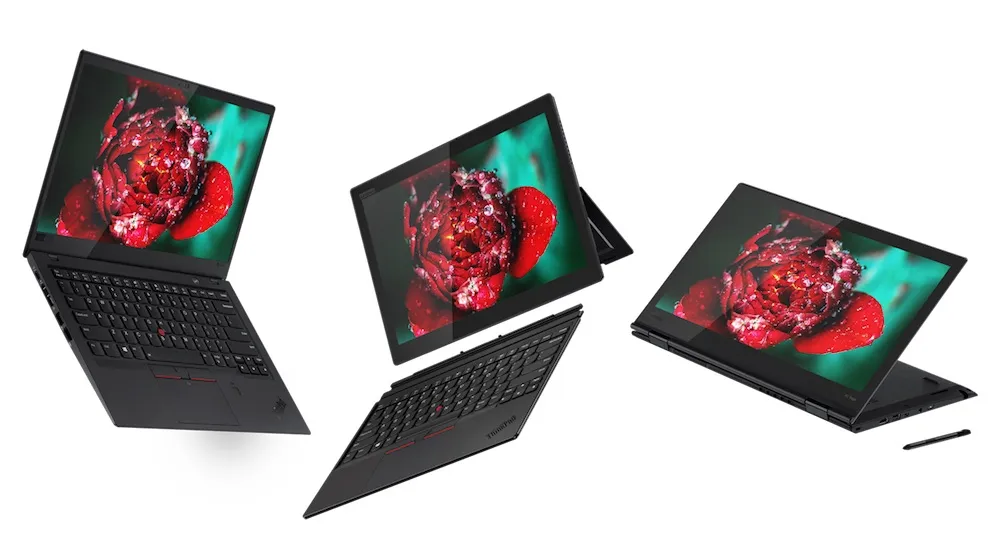
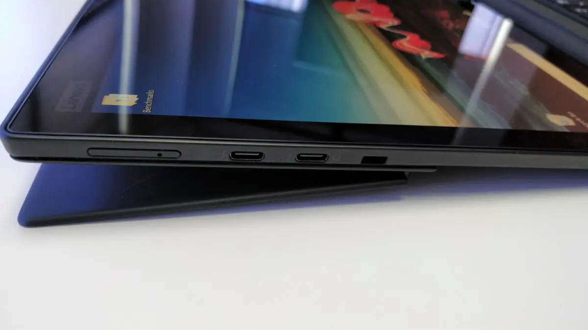
 
## Specification:

- CPU: 1.6GHz Intel Core i5-8250U (Kaby Lake-R)
- Memory: 2x4GB 1,867MHz LPDDR3
- Harddrive: 256GB PCIe-NVMe M.2 SSD
- Display: 13-inch IPS-Touch Screen (3000×2000) 
- GPU: Intel UHD 620
- Camera: Front: 2MP, rear: 8MP
- WLAN: Intel dual-band 8265 Wireless 802.11ac (2 x 2) & Bluetooth 4.1
- Battery: Integrate Li-Polymer 42Wh internal battery
- Audio: Realtek HDA ALC295
- 2 x USB-C/Thunderbolt 3 Alpine Ridge (power delivery, DisplayPort, data transfer)
- NanoSIM card/microSD combo slot
- Headphone / mic combo 

## BIOS Settings:V 1.49

The bios must be properly configured prior to installing macOS.
In Security menu, set the following settings:

-  `Security > Security Chip`: must be **Disabled**
-  `Memory Protection > Execution Prevention`: must be **Enabled**
-  `Virtualization > Intel Virtualization Technology`: must be **Enabled**
-  `Virtualization > Intel VT-d Feature`: must be **Enabled**
-  `Anti-Theft > Computrace -> Current Setting`: must be **Disabled**
-  `Secure Boot > Secure Boot`: must be **Disabled**
-  `Intel SGX -> Intel SGX Control`: must be **Disabled**
-  `Device Guard`: must be **Disabled**

In Thunderbolt menu, set the following options:

-  `Thunderbolt BIOS Assist Mode`: **UEFI Only**
-  `Wake by Thunderbolt(TM) 3`: **No**
-  `Security Level`: **No**
-  `Support in Pre Boot Environment > Thunderbolt(TM) device`: **No**

In Display menu, set the following options:
         
-  `Boot Display Device` : **LCD**
-  `Shared Display Priority` **HDMI**
-  `Total Garphics Memory` : **256MB**
-  `Boot Time Extension` : **Disabled**	   
   
## Working:

 - Keyboard (USB)
 - Touchscreen with gestures and Pen (Fix 10\9\2023) Thank [Lorys89](https://github.com/Lorys89)
 - Battery indicator
 - Audio (Internal)
 - GPU acceleration
 - Camera
 - Intel Wireless / Bluetooth
 - Native CPU power management
 - MicroSD card reader
 - HDMI video and audio 
 - Thunderbolt JHL6540 Alpine Ridge Work whit HotPlug 
 - Sleep\Wake Fix 30\8\2023 Thank [Vorshim92](https://github.com/Vorshim92)
 - Trackpad (USB) 9\9\2023 Thank [Lorys89](https://github.com/Lorys89)
  
## Not Work:

 - Internal Microphone

## USB Map:

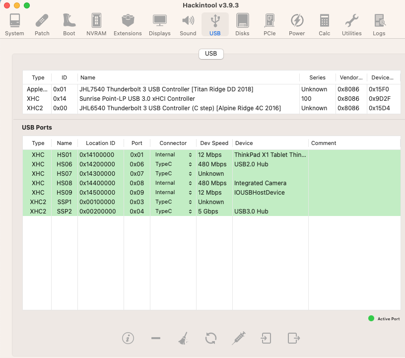

## Video Output:

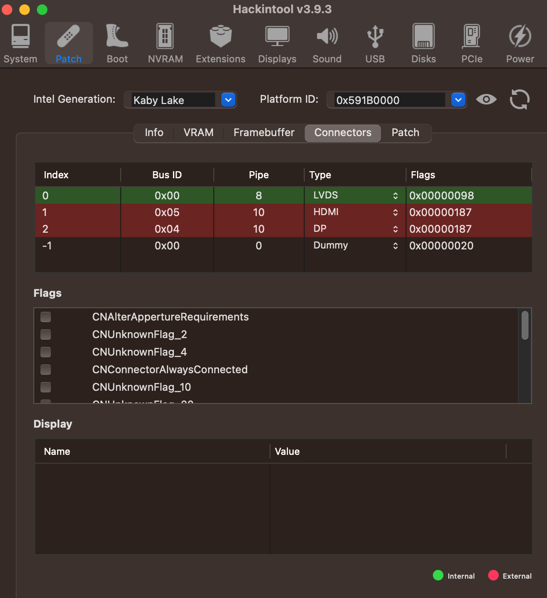
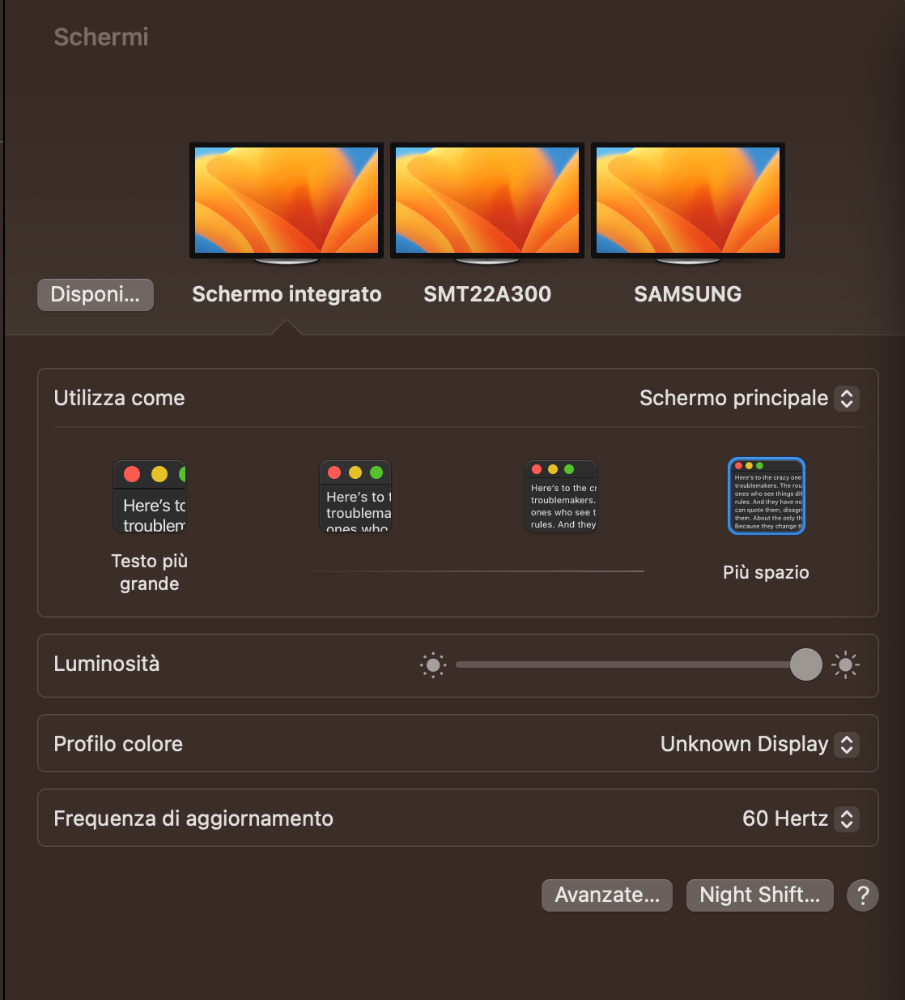

## SSDT Full Hack

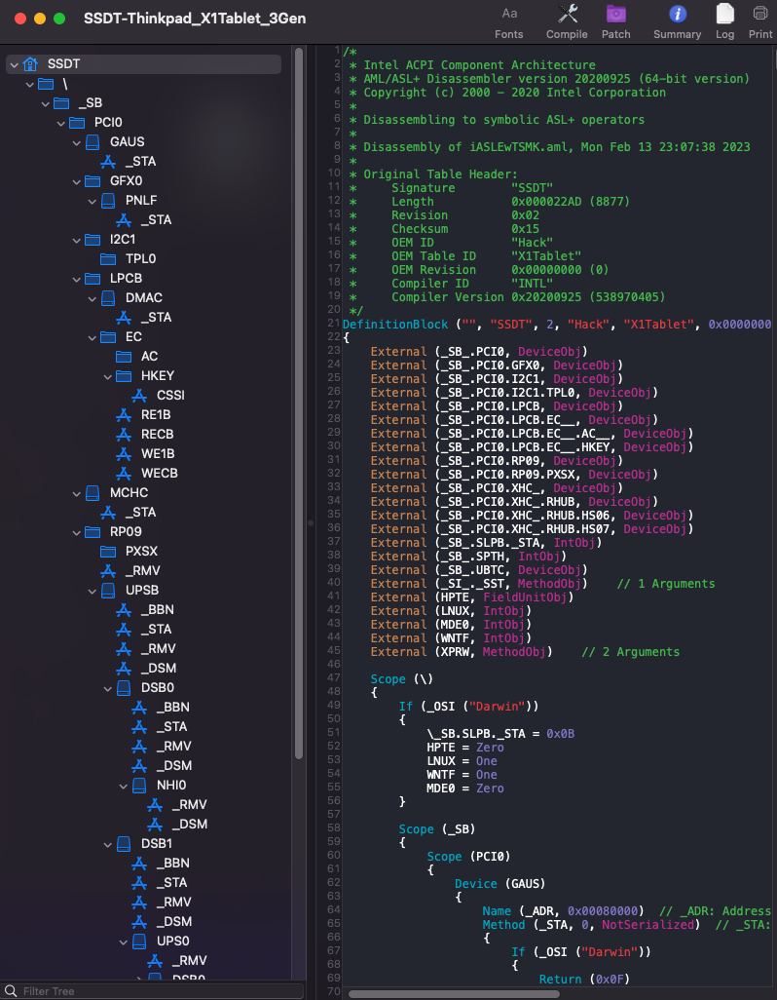
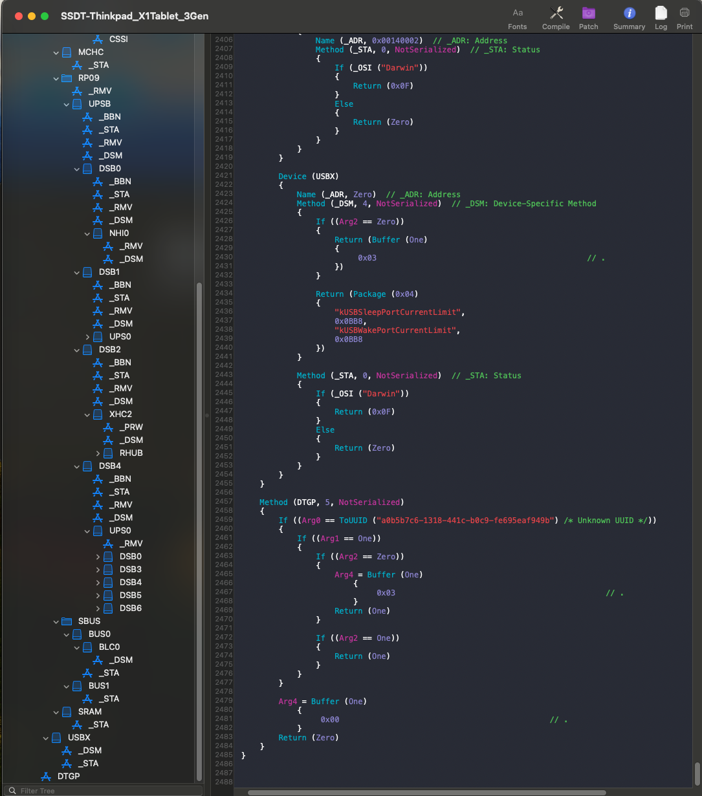

## HWMonitor

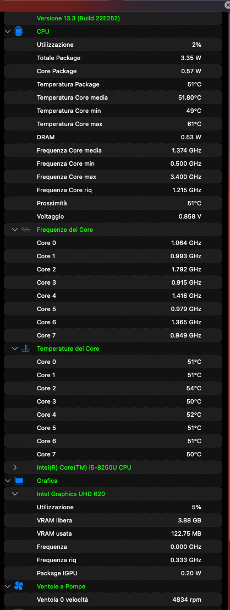
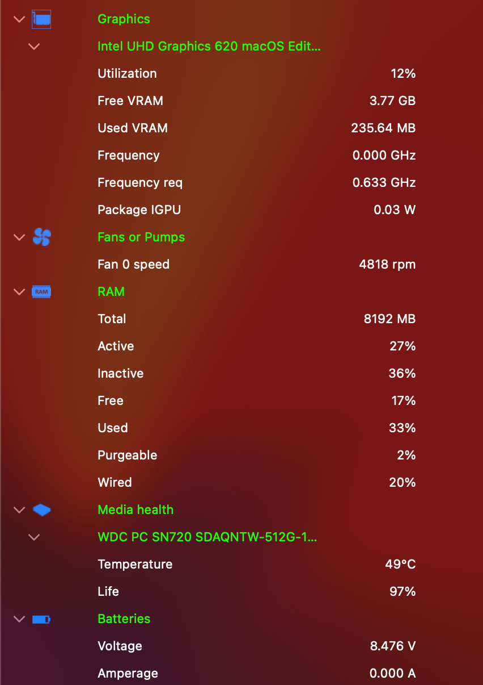

## Patch IGPU:

```
                <key>PciRoot(0x0)/Pci(0x2,0x0)</key>
                <dict>
                    <key>AAPL,GfxYTile</key>
                    <data>AQAAAA==</data>
                    <key>AAPL,ig-platform-id</key>
                    <data>BQDAhw==</data>
                    <key>AAPL,slot-name</key>
                    <string>Internal</string>
                    <key>device-id</key>
                    <data>wIcAAA==</data>
                    <key>device_type</key>
                    <string>VGA compatible controller</string>
                    <key>disable-agdc</key>
                    <data>AQAAAA==</data>
                    <key>force-online</key>
                    <data>AQAAAA==</data>
                    <key>framebuffer-patch-enable</key>
                    <data>AQAAAA==</data>
                    <key>framebuffer-stolenmem</key>
                    <data>AACgAQ==</data>
                    <key>framebuffer-unifiedmem</key>
                    <data>AAAAwA==</data>
                    <key>model</key>
                    <string>Intel Graphics UHD 620</string>
                </dict>
```

## YogaSMC Panel 2.0 Partial functions "keyboard USB"

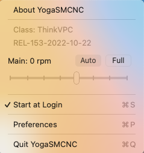

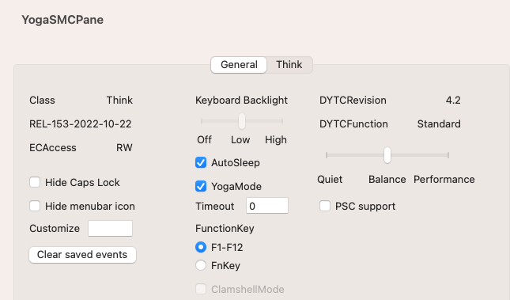

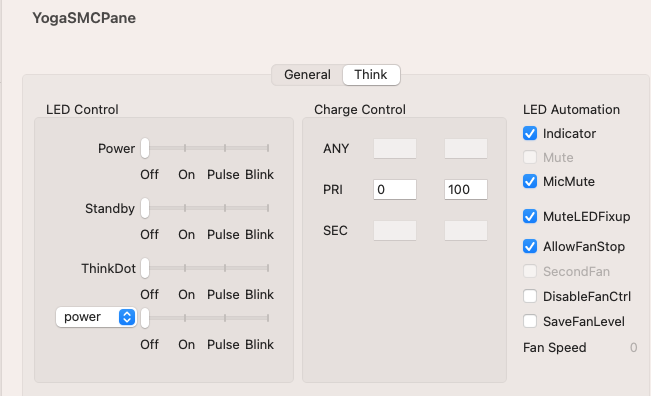 

## Credits

- [Apple](https://apple.com) for macOS.
- [Acidanthera](https://github.com/acidanthera) for OpenCore and all the lovely hackintosh work.
- [Dortania](https://dortania.github.io/OpenCore-Install-Guide/config-laptop.plist/icelake.html) For great and detailed guides.
- [Hackintoshlifeit](https://github.com/Hackintoshlifeit) Support group for installation and post installation.
